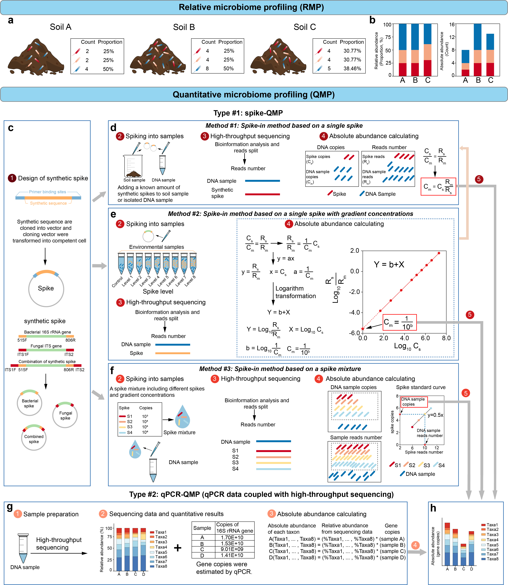

```{r setup, include=FALSE}
knitr::opts_chunk$set(
  collapse = TRUE,
  comment = "#>")
```

## a-b. The pitfalls of RMP.
## c-h. The current QMP strategies including spike-QMP and qPCR-QMP.

This figure is manually drawn by Adobe Illustrator.



