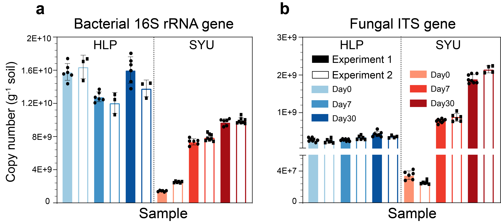

```{r setup, include=FALSE}
knitr::opts_chunk$set(
  collapse = TRUE,
  comment = "#>")
```

## a. The copy number of bacterial 16S rRNA gene and fungal ITS gene were quantified by qPCR.

This figure is generated using GraphPad Prism 8 and modified by Adobe Illustrator.




