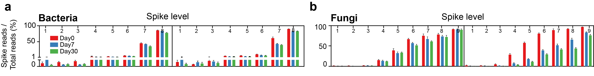

```{r setup, include=FALSE}
knitr::opts_chunk$set(
  collapse = TRUE,
  comment = "#>")
```

## a-b. he proportion of spike reads in total sequencing reads at each spike level.


## c-d. The relationship between the spike copies and the ratio of spike reads to DNA sample reads.

Fig. 3a-d is generated using Excel.

## e-f. Thequantitative abundance estimated  by using single spike, spike linear relationship and qPCR results.

Fig. 3e-f is generated using GraphPad Prism 8.


This figure is manually modified by Adobe Illustrator.


