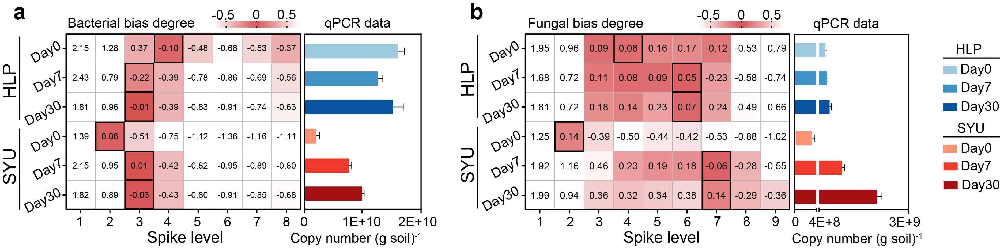
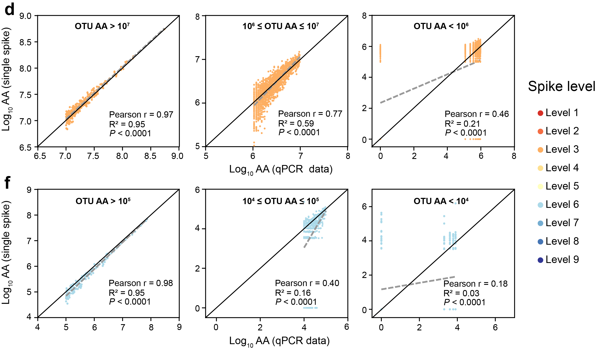

```{r setup, include=FALSE}
knitr::opts_chunk$set(echo = TRUE)
options(knitr.duplicate.label = "allow")
```

## a-b. Heatmaps displaying the bias degree and the best matching spike level.
Fig. 4a-b is generated using GraphPad Prism 8.


## c, e. The scatter plot showing bacterial (c) and fungal (e) OTU AAs calculated by qPCR data (x-axis) and single spike data (y-axis)

```{r install,eval=TRUE, include=TRUE, echo = TRUE}
library("ggplot2")
library("ggpubr")
library(reshape2)
```

## paramater setting and import table

```{r parameter, echo = TRUE}
point=read.csv("16S_point.csv",header = T,row.names=1,sep = ",") 
```

## Data format conversion

```{r data, echo = TRUE}
#sub_fap$fap=rownames(sub_fap)
point_melt <- melt(point,id.vars = c("Control"),variable.name = "Spike",value.name = "Copies")
width = 120
height = 100#180
```

## Plot
```{r plot, echo = TRUE}
group= "16SHLP_Day30"
p1 = ggplot(point_melt, aes(x=Control, y=Copies,color=Spike))+ geom_point(size=1,alpha=1)+ labs(x='Log10 QA (qPCR data)',y='Log10 QA (single spike)')+
theme(panel.background = element_rect(colour = "black"))+theme_bw()+
theme(panel.grid.major =  element_line(size=0.1),panel.grid.minor = element_line(size = 0.1))+
 theme(axis.text.x = element_text(size = 8),axis.text.y = element_text(size = 8))+
   theme(axis.title.y= element_text(size=10))+theme(axis.title.x = element_text(size = 10))+
  theme(legend.title=element_text(size=10),legend.text=element_text(size=8))+
ggtitle(paste0(group))+theme(plot.title = element_text(size = 10))+ scale_color_brewer(palette = 'RdYlBu')+scale_y_continuous(limits = c(0, 10))+scale_x_continuous(limits = c(0, 10))

p1#16S
#The plot of ITS gene can be generated using the same code.
```

## d, f. The difference of OTU AAs calculated by qPCR and best matching spike level is further shown at the three different abundance levels.
Fig. 4d, f is generated using GraphPad Prism 8.



