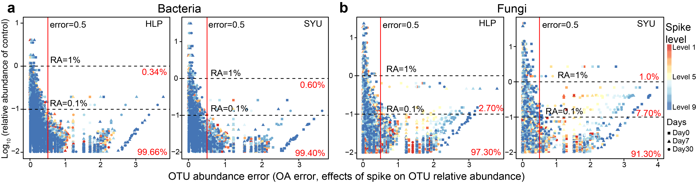
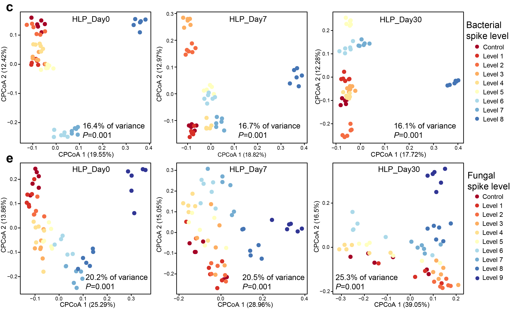
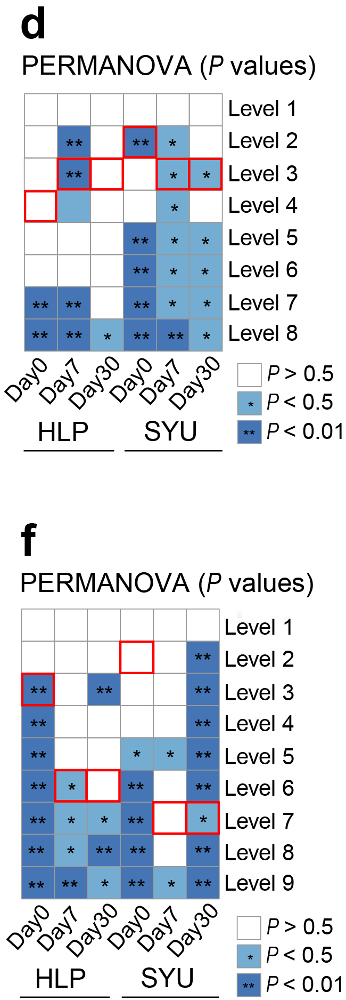

```{r setup, include=FALSE}
knitr::opts_chunk$set(echo = TRUE)
options(knitr.duplicate.label = "allow")
```

# a-b OTU abundance error (AA error)

```{r install,eval=TRUE, include=TRUE}
library("ggplot2")
```

## paramater setting and import table

```{r parameter, warning=FALSE}
point<-read.table("16S_SYU_AA_error.txt",header = T, row.names=1)
width = 120
height = 100
```

## Plot

```{r plot scatter plot}
group= "SYU_AA_error"
p = ggplot(point, aes(x=SS_error, y=RA,color=Level,shape=Time))+ geom_point(size=1.5,alpha=1)+ labs(x='AA error',y='Log10(relative abundance)')+
theme(panel.background = element_rect(colour = "black"))+theme_bw()+
theme(panel.grid.major =  element_line(size=0.1),panel.grid.minor = element_line(size = 0.1))+
 theme(axis.text.x = element_text(size = 8),axis.text.y = element_text(size = 8))+
   theme(axis.title.y= element_text(size=10))+theme(axis.title.x = element_text(size = 10))+
  theme(legend.title=element_text(size=10),legend.text=element_text(size=8))+
ggtitle(paste0(group))+theme(plot.title = element_text(size = 10))+ scale_color_brewer(palette = 'RdYlBu')+ 
geom_hline(yintercept = 0, linetype="dashed",color = "black", size=0.5)+geom_hline(yintercept = -1, linetype="dashed",color = "black", size=0.5)+geom_vline(xintercept = 0.5, linetype="dashed",color = "red", size=0.5)+annotate("text",x=3.5,y=0.2,label="RA=1%",size=2)+annotate("text",x=3.5,y=-0.8,label="RA=0.1%",size=2)+annotate("text",x=0.5,y=1,label="error=0.5",size=2)
                                                                        
p
#ggsave(paste0("16S",group,".JPEG"), p, width = width, height = height, units = "mm")
```

All of AA error plots are grouped together by Adobe Illustrator


# Beta diversity-CAP

## install packages and source

```{r install packages and source,eval=TRUE, include=TRUE}
library("ggplot2")
library("scales")
library("grid")
library("vegan")
source("cpcoa.func.R")
```

## paramater setting import distance

```{r parameter and data, warning=FALSE}
sqrt_transform <- T
width = 120
height = 100
otu_table<-read.table("otu_rare_ITS.txt",header = T, row.names=1)
design<-read.csv("metadata_ITS.csv",header = T,row.names=1,sep = ",")
```

## filter data and sequences

```{r}
idx = rownames(design) %in% colnames(otu_table) 
#extract sub_group
X=which(design$Site=="HL")
sub_design=design[X,]
sample= otu_table[,rownames(sub_design)] 

Y=which(sub_design$Incubation.time=="Raw")
sub_design2=sub_design[Y,]
sub_sample=sample[,rownames(sub_design2)] 
```

## CAP

```{r beta_cpcoa, fig.show='asis'}
#capscale
capscale.gen <- capscale(t(sub_sample) ~ Treatment, data=sub_design2, add=F, sqrt.dist=sqrt_transform, distance="bray")  
#capscale.gen <- capscale(t(otu_table) ~ Treatment + Condition(Site), data=design, add=F, sqrt.dist=sqrt_transform, distance="bray") 

# ANOVA-like permutation analysis
perm_anova.gen <- anova.cca(capscale.gen)
print(perm_anova.gen)
                                                    
# generate variability tables and calculate confidence intervals for the variance

var_tbl.gen <- variability_table(capscale.gen)
eig <- capscale.gen$CCA$eig
variance <- var_tbl.gen["constrained", "proportion"]
p.val <- perm_anova.gen[1, 4]

# extract the weighted average (sample) scores
points <- as.data.frame(capscale.gen$CCA$wa) 
#points <- capscale.gen$CCA$wa[, 1:2]
points = cbind(points, design[match(rownames(points), rownames(design)), ])
```

## plot

```{r}
p <- ggplot(points, aes(x=CAP1, y=CAP2, color=Treatment,shape=Site)) +
  geom_point(alpha=1, size=3) +
  theme(panel.background = element_rect(colour = "black"))+theme_bw()+
  theme(panel.grid.major =  element_line(size=0.1),panel.grid.minor = element_line(size = 0.1))+
 theme(axis.text.x = element_text(size = 8),axis.text.y = element_text(size = 8))+
   theme(axis.title.y= element_text(size=10))+theme(axis.title.x = element_text(size = 10))+
  theme(legend.title=element_text(size=10),legend.text=element_text(size=8))+
  scale_color_brewer(palette = 'Paired') +
  labs(x=paste("CPCoA 1 (", format(100 * eig[1] / sum(eig), digits=4), "%)", sep=""),
       y=paste("CPCoA 2 (", format(100 * eig[2] / sum(eig), digits=4), "%)", sep="")) + 
  ggtitle(paste(format(100 * variance, digits=3), " % of variance; p=",
                format(p.val, digits=2),
                sep=""))#+stat_ellipse(level = 0.95)
p
```

All of CAP plots are grouped together by Adobe Illustrator


# PERMANOVA

## install packages and source

```{r install vegan,eval=TRUE, include=TRUE}
library("vegan")
```

## import otu_rare and design file

```{r data, warning=FALSE}
design<- read.csv("metadata_ITS.csv",header = T, row.names=1,sep =",")
otu<-read.table("otu_rare_ITS.txt",header = T, row.names=1)
otu=t(otu)
```

## filter data and sequences

```{r filter data}
X=which(design$Site=="SY")
sub_design=design[X,]
HL_otu = otu[rownames(sub_design), ] 

Y=which(sub_design$Incubation.time=="Day30")
sub_sub_design=sub_design[Y,]
sub_otu=HL_otu[rownames(sub_sub_design), ] 

```

## Adonis analysis

```{r adonis, warning=FALSE}
adonis(sub_otu~ Treatment,data = sub_sub_design,permutations = 999,method="bray")->ad1
ad1
```

## pairwise comparison for PERMANOVA

```{r pairwise, warning=FALSE}
pairwise.adonis <-function(x,factors, sim.method, p.adjust.m)
{
  library(vegan)
  co = as.matrix(combn(unique(factors),2))
  pairs = c()
  F.Model =c()
  R2 = c()
  p.value = c()
  for(elem in 1:ncol(co)){
    ad = adonis(x[factors %in%c(as.character(co[1,elem]),as.character(co[2,elem])),] ~
                  factors[factors %in%c(as.character(co[1,elem]),as.character(co[2,elem]))] , method =sim.method);
    pairs =c(pairs,paste(co[1,elem],'vs',co[2,elem]));
    F.Model =c(F.Model,ad$aov.tab[1,4]);
    R2 = c(R2,ad$aov.tab[1,5]);
    p.value = c(p.value,ad$aov.tab[1,6])
  }
  p.adjusted =p.adjust(p.value,method=p.adjust.m)
  pairw.res = data.frame(pairs,F.Model,R2,p.value,p.adjusted)
  return(pairw.res)
}
pairwise.adonis(sub_otu, sub_sub_design$Treatment, sim.method="bray", p.adjust.m= "fdr")
```

# d, f: PERMANOVA P value-heatmap
Fig. 5d, f is generated using GraphPad Prism 8 and modified by Adobe Illustrator.


Reference
CAP:Root nodule symbiosis in Lotus japonicus drives the establishment of distinctive rhizosphere, root, and nodule bacterial communities (2016, PNAS)


