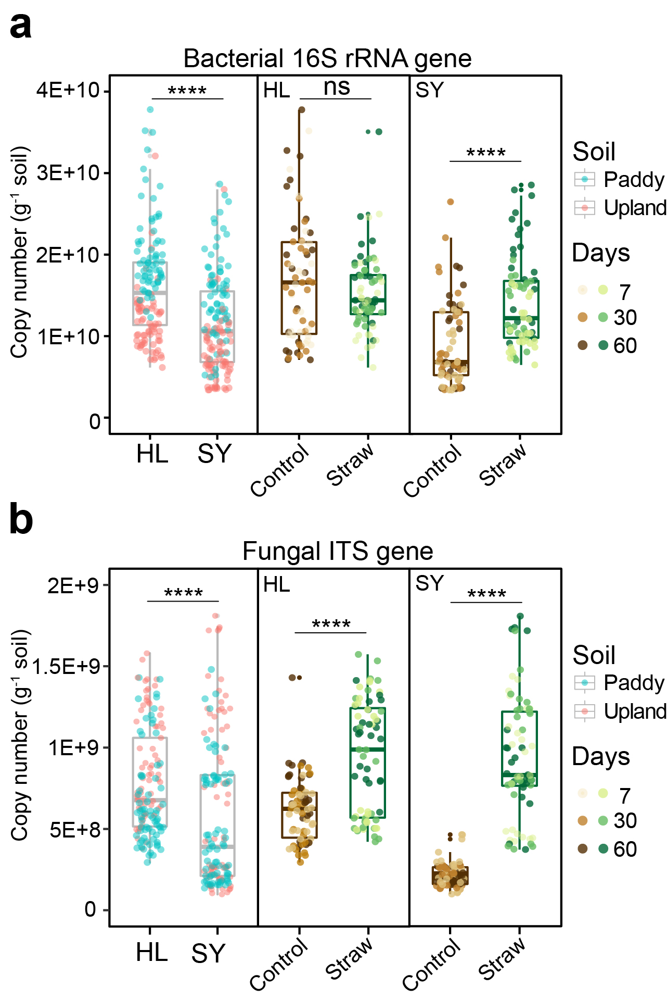
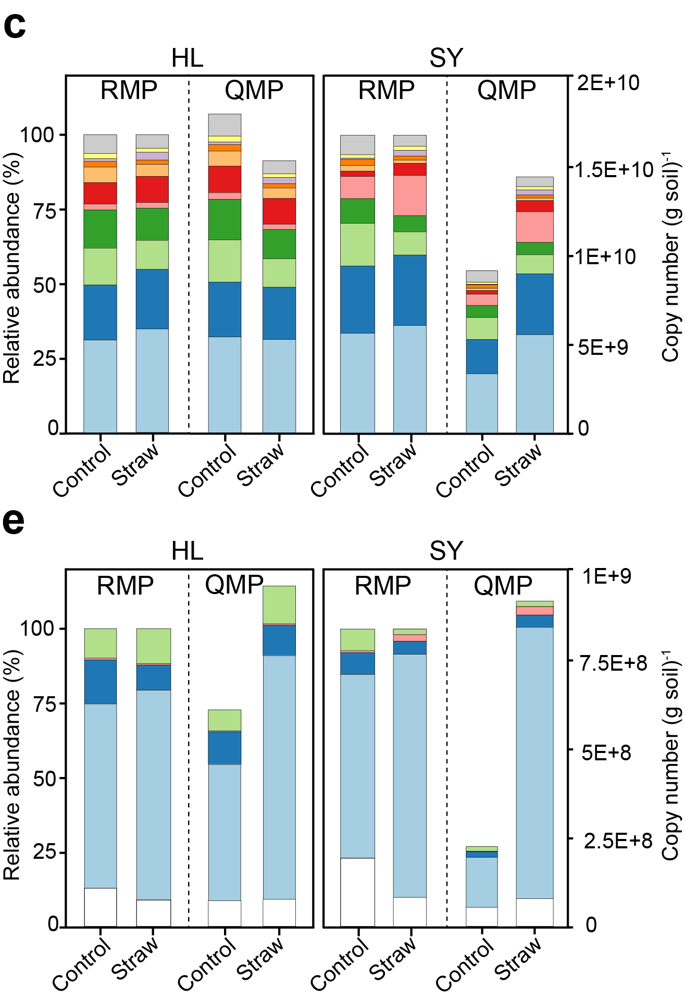
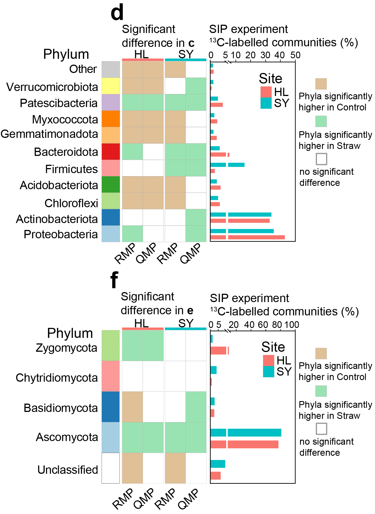
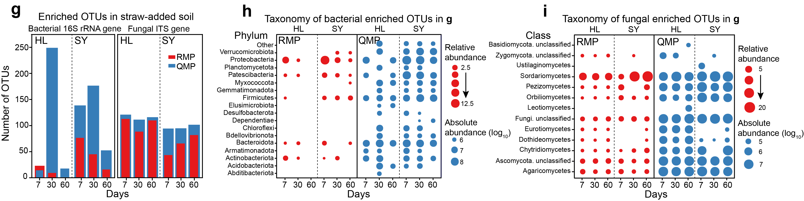

```{r setup, include=FALSE}
knitr::opts_chunk$set(echo = TRUE)
options(knitr.duplicate.label = "allow")
```


# a-b The 16S rRNA and ITS gene copies in Hailun (HL) and Sanya (SY) soils.

```{r loading}
library(amplicon) 
library(pheatmap)
library(ggplot2)
```

## boxplot

```{r boxplot}
#import data
copy = read.table("copy.txt", header=T, row.names=1, sep="\t", comment.char="")
Treat=factor(copy$Site,levels = c("HL","SY"))
#sub_group
X=which(copy$Gene=="16S")
sub_copy=copy[X,]
#Y=which(sub_copy$Site=="SY")
#treat_copy=sub_copy[Y,] #CK and Straw
group="16S"
p0 <- ggplot(sub_copy, aes(x=Site, y=Copy, fill=Site,color=Site)) + geom_boxplot(width=0.5,outlier.size = 0.01,alpha=0.5)+
theme(panel.background = element_rect(colour = "black"))+theme_bw()+theme(legend.title=element_text(size=6),legend.text=element_text(size=6))+
  theme(legend.position='right',legend.key.size = unit(0.4,'cm'))+
  
  theme(panel.grid.major =  element_line(size=0.1),panel.grid.minor = element_line(size = 0.1))+
  theme(axis.title.y= element_text(size=6))+theme(axis.title.x = element_text(size = 6))+
  theme(axis.text.x = element_text(size = 6),axis.text.y = element_text(size = 6))+
  xlab("Site")+ylab("Gene number")+
  ggtitle(paste0(group))+theme(plot.title = element_text(size = 6))
  p0
p1 <- p0+geom_jitter(width = 0.2,aes(color=Soil),size=0.5,alpha=0.5)+
  scale_fill_manual(values=c("white", "white"))+
  expand_limits(y=c(0,2000000000))
p1
width=59
height = 75
ggsave(paste0("Copies_",group,".pdf"), p1, width = width, height = height, units = "mm")
```

Fig. 6a-b are grouped by Adobe Illustrator.

# c,e: Phylum-level of bacterial (c) and fungal (e) community compositions are determined by RMP and qPCR-QMP.

Fig. 6c, e are generated using GraphPad Prism 8 and modified by Adobe Illustrator


# d,f: P value heatmap.

```{r heatmap}
#导入数据
p = read.table("ITS_P.txt", header=T, row.names=1, sep="\t", comment.char="")
group="ITS_Pvalue"

#分组信息利用annotation_col和annotation_row参数同时添加行和列的注释信息
colgroup = read.table("col_group.txt", header=T, row.names=1, sep="\t", comment.char="")
rowgroup = read.table("row_group.txt", header=T, row.names=1, sep="\t", comment.char="")

#利用ann_colors自定分组信息和数据的颜色
col = colorRampPalette(c("#E41A1C", "#FFFFFF"),bias=3)(100)
ann_colors = list( Site = c(HL="#F8766D", SY= "#00BFC4"), Method = c(RA ="#FFB100",AA= "#156AAE"))#设置注释信息颜色

#绘图
pheatmap(p,cluster_row = FALSE, cluster_col = FALSE,#不进行聚类，按照导入数据的顺序作图
         filename = paste(group, "_heatmap.pdf", sep=""),#文件名
         annotation_col = colgroup,annotation_row=rowgroup,#添加分组信息
         col=col,annotation_colors = ann_colors, gaps_col = c(2))#自定义颜色
```

Fig. 6d, f are modified by Adobe Illustrator.


# g-i Enriched OTUs under straw additon

```{r bubble plot}
# enrich = read.table("16S_RA_enrich.txt", header=T, row.names=1)
# group="16S_RA_enrich"
# Group=factor(enrich$SampleGroup,levels = c("HL_7","HL_30","HL_60","SY_7","SY_30","SY_60"))
# 
# #Relative abundance
# p1 = ggplot(enrich,aes(Group,Decription))+geom_point(aes(size=RA,color=Treatment))+
#   ggtitle(paste0(group))+theme(plot.title = element_text(size = 6))+
#   labs(x="Days",y="Phylum")+
#   scale_colour_manual(values="#E41A1C")+
#    theme(panel.background = element_rect(colour = "black"))+theme_bw()+theme(legend.title=element_text(size=6),legend.text=element_text(size=6))
# p1
#绝对丰度
# enrich_AA = read.table(
#   "16S_AA_enrich.txt",
#   header = T,
#   row.names = 1,
#   sep = "\t",
#   comment.char = ""
#   )
#   group = "16S_AA_enrich"
#   Group1 = factor(enrich$SampleGroup,
#   levels = c("HL_7", "HL_30", "HL_60", "SY_7", "SY_30", "SY_60"))
#   p2 = ggplot(enrich_AA, aes(Group1, Decription)) + geom_point(aes(size =
#   log10(AA), color = Treatment)) + 
#   ggtitle(paste0(group)) + theme(plot.title = element_text(size = 6)) + 
#   labs(x = "Days", y = "Phylum") + 
#   scale_colour_manual(values = "#377EB8") + 
#   theme(panel.background = element_rect(colour = "black")) + theme_bw() +
#   theme(legend.title = element_text(size = 6),
#   legend.text = element_text(size = 6))
#   p2
# width=110
# height = 95
# ggsave(paste0("Abundance_",group,".pdf"), p, width = width, height = height, units = "mm")
```

Fig. 6g-i are modified by Adobe Illustrator.



