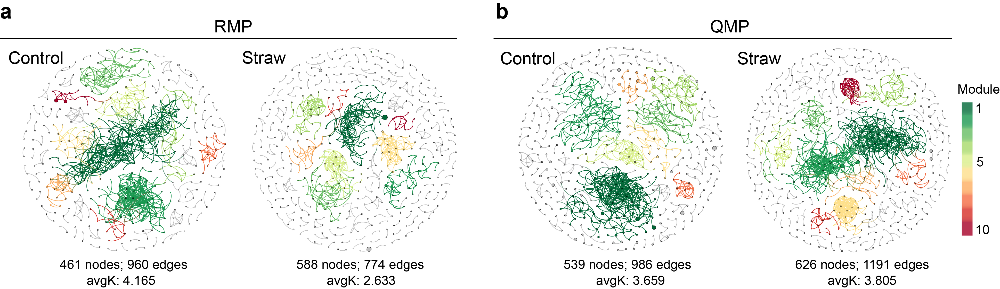
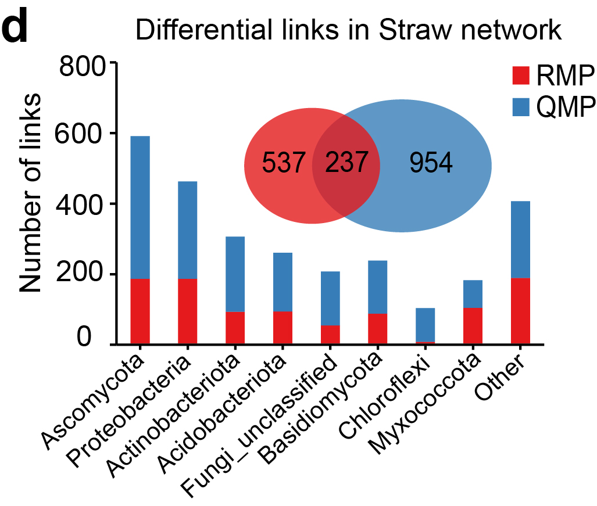
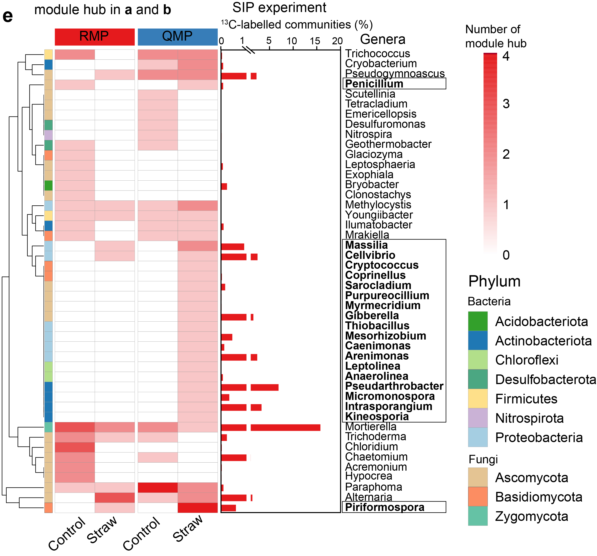

```{r setup, include=FALSE}
knitr::opts_chunk$set(echo = TRUE)
options(knitr.duplicate.label = "allow")
```

# library

```{r loading}
library(amplicon)
library("ggplot2")
library("ggpubr")
library(pheatmap)
```

# a-b: Visualization of bacterial and fungal OTUs interactions by using the RMP and the QMP data matrix.
Fig. 7a-b are reconstructed in Molecular Ecological Network Analyses (MENA) pipeline (http://ieg4.rccc.ou.edu/mena/).

# c: network node index

```{r boxplot}
node_design = read.table("node_design.txt", header=T, row.names=1, sep="\t", comment.char="")

Treat=factor(node_design$Treatment,levels = c("CK_RA","Straw_RA","CK_AA","Straw_AA"))

group="Degree"
p0 <- ggplot(node_design, aes(x=Treat, y=Degree, fill=Group,color=Group)) + geom_boxplot(width=0.5,outlier.size = 0.01,alpha=0.8)+
theme(panel.background = element_rect(colour = "black"))+theme_bw()+theme(legend.title=element_text(size=6),legend.text=element_text(size=6))+
  theme(legend.position='right',legend.key.size = unit(0.4,'cm'))+
  theme(panel.grid.major =  element_line(size=0.1),panel.grid.minor = element_line(size = 0.1))+
  theme(axis.title.y= element_text(size=6))+theme(axis.title.x = element_text(size = 6))+
  theme(axis.text.x = element_text(size = 6),axis.text.y = element_text(size = 6))+
  xlab("Treatment")+ylab("Degree")+
  ggtitle("HLU_Degree")+theme(plot.title = element_text(size = 6))
  p0

p1 <- p0+geom_jitter(width = 0.2,aes(color=Group),size=0.01,alpha=0.5)+
  scale_fill_manual(values=c("white", "white","white","white"))
p1
p3=p1+scale_color_manual(values=c("#bf812d","#32c864","#bf812d","#32c864"))
p3 #Degree

group="BC"
p0 <- ggplot(node_design, aes(x=Treat, y=BC, fill=Group,color=Group)) + geom_boxplot(width=0.5,outlier.size = 0.01,alpha=0.8)+
theme(panel.background = element_rect(colour = "black"))+theme_bw()+theme(legend.title=element_text(size=6),legend.text=element_text(size=6))+
  theme(legend.position='right',legend.key.size = unit(0.4,'cm'))+
  
  theme(panel.grid.major =  element_line(size=0.1),panel.grid.minor = element_line(size = 0.1))+
  theme(axis.title.y= element_text(size=6))+theme(axis.title.x = element_text(size = 6))+
  theme(axis.text.x = element_text(size = 6),axis.text.y = element_text(size = 6))+
  xlab("Treatment")+ylab("BC")+
  ggtitle("HLU_BC")+theme(plot.title = element_text(size = 6))
  p0

p1 <- p0+geom_jitter(width = 0.2,aes(color=Group),size=0.01,alpha=0.5)+
  scale_fill_manual(values=c("white", "white","white","white"))
p1
p2=p1+scale_color_manual(values=c("#bf812d","#32c864","#bf812d","#32c864"))
p2#BC
p=ggarrange(p3, p2, labels = c("A", "B"), nrow = 2)
p
width = 65
height = 100
ggsave(paste0("HLU_",group,".pdf"), p, width = width, height = height, units = "mm")
```

# d: taxonomic distribution of unique links detected by RMP and QMP.
Fig. 7d is generated using GraphPad Prism 8 and modified by Adobe Illustrator


# e: key species heatmap

```{r heatmap}
species = read.table("key_species.txt", header=T, row.names=1, sep="\t", comment.char="")
group="key_species"

#annotation_col和annotation_row
colgroup = read.table("col_group.txt", header=T, row.names=1, sep="\t", comment.char="")
rowgroup = read.table("row_group.txt", header=T, row.names=1, sep="\t", comment.char="")
col = colorRampPalette(c("#FFFFFF", "#E41A1C"),bias=3)(300)
ann_colors = list( Group = c(RA="#FFB100", AA= "#156AAE"), Treatment = c(CK ="#F8766D",Straw= "#00BFC4"))

#plot
pheatmap(species,cluster_row = TRUE, cluster_col = FALSE,
         filename = paste(group, "_heatmap.pdf", sep=""),
         annotation_col = colgroup,annotation_row=rowgroup,
         col=col,annotation_colors = ann_colors, gaps_col = c(2))
```
Fig. 7e is grouped and modified by Adobe Illustrator.

